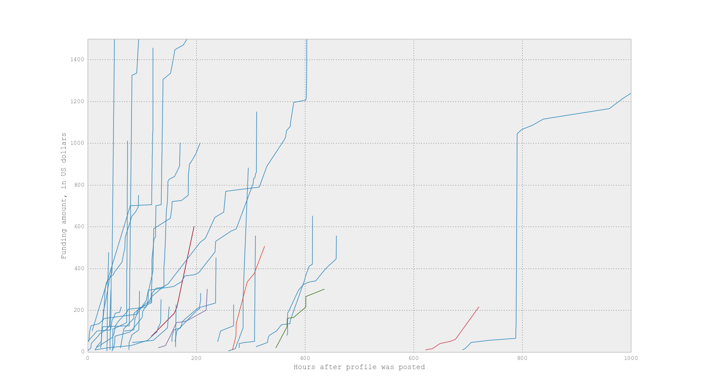

#Can we predict the funding pattern of a crowdfunding profile?

We have data from a Kickstarter-like company. Profiles list different amounts at
which to be funded. Nearly all the profiles end up getting funded. All the
profiles in this dataset have been funded. Taken from a subset of the data, it
looks like this:

If we can find out various attributes that predict a funding pattern, we can
optimize for these various attributes so that profiles can be funded more
quickly!

So, we want to see if there are different funding patterns amongst the different
rates at which profiles get funded. If there are, we can try to predict which
pattern a certain profile fits into, and what factors lead to certain patterns.

    %matplotlib inline
    import psycopg2
    import pandas as pd
    import numpy as np
    import matplotlib.pyplot as plt
    import getpass
    from numpy import log1p
    import random
    
    pd.options.display.mpl_style = 'default'
    
    conn = psycopg2.connect(dbname="funding_data", host="localhost", user="aok1425", password=getpass.getpass())
    cur = conn.cursor()

##Exploratory data analysis

Note: All of the profiles in this analysis have been funded. Most (>95%) of all
profiles posted to the site are funded.

    def pull_SQL_into_Pandas(query):
    	"""Takes a query, and outputs a DataFrame from it."""
    	cur.execute(query)
    	fig = pd.DataFrame(cur.fetchall(), columns = [desc[0] for desc in cur.description])
    
    	return fig

    # I've filtered out those profiles that were funded in one donation
    query = """
        select patient, hrs_to_completion, hrs_to_completion - first_donation as "completion_after_first_donation", funding_amt
        from (select p.id as patient, max(c.created_at - p.created_at) as "hrs_to_completion", min(c.created_at - p.created_at) as "first_donation", count(c.created_at) as "num", (p.target_amount * .01)::int as "funding_amt"
        from contributions as c join profiles as p
        on (c.contributable_id = p.id)
        group by patient) table1
        where (hrs_to_completion - first_donation) > interval '0 seconds';"""
    
    fig = pull_SQL_into_Pandas(query)

The histogram of how quickly profiles are funded, below, is heavily left-skewed.

    ax = fig.hrs_to_completion.apply(lambda x: x / np.timedelta64(1,'h')).hist(bins=50, range=[0,1500])
    ax.set_xlabel('Hours to fund profile after posting')
    ax.set_ylabel('Frequency')

    <matplotlib.text.Text at 0x106550490>

If we look at how quickly profiles are funded after the first donation, instead
of when they were posted, we can see that most of the profiles get funded more
quickly than we might have thought from the chart above.

    ax = fig.completion_after_first_donation.apply(lambda x: x / np.timedelta64(1,'h')).hist(bins=50, range=[0,200])
    ax.set_xlabel('Hours to fund profile after first donation')
    ax.set_ylabel('Frequency')

    <matplotlib.text.Text at 0x1065d4650>

25% of the profiles get funded within 17 hours of the first donation.

    fig.completion_after_first_donation.apply(lambda x: x / np.timedelta64(1,'h')).describe()

    count     1013.000000
    mean       365.379089
    std       1224.636569
    min          0.002365
    25%         17.065000
    50%         56.298889
    75%        134.088721
    max      13996.087957
    dtype: float64

But what if some profiles are funded more quickly because their funding amount
is less?

Let's look into this. What does the distribution of the funding amount look
like?

    ax = fig.funding_amt.hist(bins=20, range=[0,2500])
    ax.set_xlabel('Funding amount, in US dollars')
    ax.set_ylabel('Frequency')

    <matplotlib.text.Text at 0x106a84bd0>

Many of the profiles have small (>$500) funding amounts. This could bias our
understanding of how quickly profiles are funded, because profiles with smaller
funding amounts may be funded more quickly than others.

Let's control for their funding amount.

    ax = (fig.completion_after_first_donation.apply(lambda x: x / np.timedelta64(1,'h'))*100/fig.funding_amt).hist(bins=50, range=[0,200])
    ax.set_xlabel('Hours to fund profile after first donation, per $100')
    ax.set_ylabel('Frequency')

    <matplotlib.text.Text at 0x106ad8d90>

In the original histogram, some profiles took longer to fund because their
funding amounts were higher. In this histogram, now that we're looking at the
rate of funding, we see that most profiles get funded quickly, moreso than just
by looking at the number of hours it takes to fund a profile.

It took 3 hours for the top 25% of profiles to raise \$100. The top 50% percent
of profiles raised $100 in 9 hours.

    (fig.completion_after_first_donation.apply(lambda x: x / np.timedelta64(1,'h'))*100/fig.funding_amt).describe()

    count    1013.000000
    mean       47.173583
    std       177.759792
    min         0.000788
    25%         2.975677
    50%         8.747876
    75%        20.431236
    max      2795.191217
    dtype: float64

                25% of the profiles were funded in 4.6 hours or less.

Thus, I only want to find out about the other 75%. [show that the 25% has same characteristics as the 75%?]
                
###Do the profiles that go for <\$500 and the profiles that go for >\$500 have
different funding rates?

Some profiles that get funded really quickly (maybe they only needed one
donation, or they had a small funding amount), I want to leave out of the
modeling analysis. How to determine the cut-off? Rate? Absolute \$\$\$ amt? If
rate, how many high-\$\$\$ amt profiles does it contain?

##Pulling the data

    def pull_funding_for_pt(patient_id):    
    	query = """
    		select donor_id, patient, cum_amt::int, hours_after_posted, num
    		from (
    		select *, bool_and(hours_after_posted >= 0) over (partition by patient) as normal_hours_after_posted, max(cum_amt) over (partition by patient) as max_amt, count(*) over (partition by patient) as "num"
    		from (
    		select donor_id, patient, sum(donation_amt) over (partition by patient order by time_of_donation) as cum_amt, total_amt, extract(epoch from (time_of_donation - min(time_of_donation) over (partition by patient)))/3600 as hours_after_posted, extract(epoch from hrs_to_completion)/3600 as hrs_to_completion
    		from (
    		select donor_id, p.id as patient, c.donation_amount * .01 as "donation_amt", p.target_amount * .01 as total_amt, c.created_at - p.created_at as "time_of_donation", max(c.created_at - p.created_at) over (partition by p.id) as "hrs_to_completion"
    		from contributions as c join profiles as p
    		on (c.contributable_id = p.id)
    		where contributable_id = {}) table1) table2) table3
    		where @(max_amt-total_amt)/total_amt < 0.1 and normal_hours_after_posted = true
    		order by patient, cum_amt;""".format(patient_id)
        
    	return pull_SQL_into_Pandas(query)

The function above pulls the funding rate data for a patient:

    pull_funding_for_pt(704)

<table border="1" class="dataframe">
  <thead>
    <tr style="text-align: right;">
      <th></th>
      <th>donor_id</th>
      <th>patient</th>
      <th>cum_amt</th>
      <th>hours_after_posted</th>
      <th>num</th>
    </tr>
  </thead>
  <tbody>
    <tr>
      <th>0</th>
      <td> 1410</td>
      <td> 704</td>
      <td>  20</td>
      <td>  0.000000</td>
      <td> 4</td>
    </tr>
    <tr>
      <th>1</th>
      <td> 4092</td>
      <td> 704</td>
      <td>  26</td>
      <td>  2.498893</td>
      <td> 4</td>
    </tr>
    <tr>
      <th>2</th>
      <td> 4096</td>
      <td> 704</td>
      <td>  31</td>
      <td> 23.545507</td>
      <td> 4</td>
    </tr>
    <tr>
      <th>3</th>
      <td> 4097</td>
      <td> 704</td>
      <td> 300</td>
      <td> 24.693322</td>
      <td> 4</td>
    </tr>
  </tbody>
</table>

    ax = pull_funding_for_pt(704).plot(x='hours_after_posted', y='cum_amt')
    ax.set_ylabel('Funding amt, in US dollars')
    ax.set_xlabel('Hours after first donation')

    <matplotlib.text.Text at 0x106f19e50>

I've filtered out certain data if it meets the following characteristics:
- adding up all the donations results in a figure different from the total
amount, by at least 10%
- some donations were made before the profile was posted online
- I'm ignoring those profiles that were funded really quickly. Later on, I will
try to find differences between the quickly-funded profiles and the others.
Anecdotally, the main factor seems to be funding amount.

##Applying the models for each profile
For each profile, I will apply 3 different models: linear, logarithmic, and
exponential. Then, I will find the error for each model for each profile.

    def predict_exp(x, y):
    	"""Input a DataFrame and get a Series of predicted values."""
    	ydiff = y.tail(1).values[0] - y.head(1).values[0]
    	xdiff = x.tail(1).values[0] - x.head(1).values[0]
    
    	z = ydiff**(1/xdiff)
    	return z**x + y.head(1).values[0]
    
    def predict_lin(x, y):
    	m = (y.tail(1).values[0] - y.head(1).values[0])/(x.tail(1).values[0] - x.head(1).values[0])
    
    	return m*x + y.head(1).values[0]
    
    def predict_log_e(x, y):
    	ydiff = y.tail(1).values[0] - y.head(1).values[0]
    	xdiff = x.tail(1).values[0] - x.head(1).values[0]
    	b = ydiff / (log1p(xdiff))
    
    	return b*log1p(x) + y.head(1).values[0]
    
    def plot_predictor(patient_id):
    	"""Makes graph showing the 3 models and the ground truth for a patient."""
    	fig = pull_funding_for_pt(patient_id)
    	fig['lin_pred'] = predict_lin(fig.hours_after_posted, fig.cum_amt)
    	fig['exp_pred'] = predict_exp(fig.hours_after_posted, fig.cum_amt)
    	fig['log_pred'] = predict_log_e(fig.hours_after_posted, fig.cum_amt)
    
    	ax = fig.plot(x='hours_after_posted', y='cum_amt')
    	ax = fig.plot(x='hours_after_posted', y='lin_pred')
    	ax = fig.plot(x='hours_after_posted', y='exp_pred')
    	ax = fig.plot(x='hours_after_posted', y='log_pred')
    	ax.set_ylabel('Funding amt, in US dollars')
    	ax.set_xlabel('Hours after first donation')

This is an example of the models fitted to a funding curve. The blue line is the
ground truth.

    plot_predictor(506)

##Evaluating the models for each profile

    query = """
        select patient, count
        from(
        select p.id as patient, count(*) as count, @((sum(c.donation_amount)-p.target_amount::float)/p.target_amount) as diff_pct, p.target_amount * .01 as total_amt, extract(epoch from min(c.created_at - p.created_at))/3600 as "min_time_of_donation", extract(epoch from max(c.created_at - p.created_at))/3600 as "hrs_to_completion"
        from contributions as c join profiles as p
        on (c.contributable_id = p.id)
        group by p.id
        order by diff_pct desc) table1
        where diff_pct < 0.1 and min_time_of_donation > 0 and hrs_to_completion > 37.84 and count > 3;"""
    
    from sklearn.metrics import explained_variance_score
    
    def calculate_model_errors(patient_id):
        fig = pull_funding_for_pt(patient_id)
        x = fig.hours_after_posted
        y = fig.cum_amt
        
        exp = predict_exp(x,y)
        lin = predict_lin(x,y)
        log = predict_log_e(x,y)
        
        return explained_variance_score(y, exp), explained_variance_score(y, log), explained_variance_score(y, lin)
    
    df = pull_SQL_into_Pandas(query)
    df['exp_error'], df['log_error'], df['lin_error'] = zip(*df.patient.map(calculate_model_errors))

    df.tail()

<table border="1" class="dataframe">
  <thead>
    <tr style="text-align: right;">
      <th></th>
      <th>patient</th>
      <th>count</th>
      <th>exp_error</th>
      <th>log_error</th>
      <th>lin_error</th>
    </tr>
  </thead>
  <tbody>
    <tr>
      <th>673</th>
      <td> 1180</td>
      <td>  8</td>
      <td> 0.903552</td>
      <td> 0.461442</td>
      <td> 0.872866</td>
    </tr>
    <tr>
      <th>674</th>
      <td>  915</td>
      <td> 14</td>
      <td> 0.894019</td>
      <td> 0.419293</td>
      <td> 0.775915</td>
    </tr>
    <tr>
      <th>675</th>
      <td>  547</td>
      <td>  7</td>
      <td> 0.600925</td>
      <td> 0.117095</td>
      <td> 0.204800</td>
    </tr>
    <tr>
      <th>676</th>
      <td>  923</td>
      <td> 19</td>
      <td> 0.495106</td>
      <td> 0.503763</td>
      <td> 0.842688</td>
    </tr>
    <tr>
      <th>677</th>
      <td>  578</td>
      <td>  9</td>
      <td> 0.412697</td>
      <td> 0.736984</td>
      <td> 0.665104</td>
    </tr>
  </tbody>
</table>

    # The saved table, in order to reproduce the analysis
    df = pd.read_pickle('./saved_tables/error_table.pkl')

<table border="1" class="dataframe">
  <thead>
    <tr style="text-align: right;">
      <th></th>
      <th>patient</th>
      <th>count</th>
      <th>exp_error</th>
      <th>log_error</th>
      <th>lin_error</th>
    </tr>
  </thead>
  <tbody>
    <tr>
      <th>673</th>
      <td> 1180</td>
      <td>  8</td>
      <td> 0.903552</td>
      <td> 0.461442</td>
      <td> 0.872866</td>
    </tr>
    <tr>
      <th>674</th>
      <td>  915</td>
      <td> 14</td>
      <td> 0.894019</td>
      <td> 0.419293</td>
      <td> 0.775915</td>
    </tr>
    <tr>
      <th>675</th>
      <td>  547</td>
      <td>  7</td>
      <td> 0.600925</td>
      <td> 0.117095</td>
      <td> 0.204800</td>
    </tr>
    <tr>
      <th>676</th>
      <td>  923</td>
      <td> 19</td>
      <td> 0.495106</td>
      <td> 0.503763</td>
      <td> 0.842688</td>
    </tr>
    <tr>
      <th>677</th>
      <td>  578</td>
      <td>  9</td>
      <td> 0.412697</td>
      <td> 0.736984</td>
      <td> 0.665104</td>
    </tr>
  </tbody>
</table>

##Using K-Means clustering to try to find out which groups a profile best fits
into

    import kmeans
    km = kmeans.KMeans(max_iters=50, tries=30)

    from sklearn import preprocessing
    df_scaled = preprocessing.scale(df.ix[:,'exp_error':'lin_error']) #standardizing the data
    
    km.fit(df_scaled, clusters=3)

    Running K-means 30 times, moving the 3 centroids a max of 50 times on each try...
               J how many for each  \
    12  1.306399  [270, 1110, 654]   
    23  1.306399  [654, 270, 1110]   
    15  1.306982  [657, 261, 1116]   
    7   1.306982  [261, 657, 1116]   
    16  1.306982  [1116, 261, 657]   
    
                                        centroid position  
    12  [[[-1.39482808952, -1.1997728397, -1.846064307...  
    23  [[[0.704388856926, -0.668925845673, -0.2758180...  
    15  [[[0.691286567587, -0.697119487505, -0.3266305...  
    7   [[[-1.50953910147, -1.14404912421, -1.81766760...  
    16  [[[-0.0539297217046, 0.677960864435, 0.6173902...  

Plotting the cost, or error, J, of having `n` number of groups, it seems like
the data doesn't strongly fit into any particular number of groups.

    km.plotj(7) # I cld choose 3 or 4 centroids

    Calculating for K=2, K=3, K=4, K=5, K=6, K=7

    km.fit(df_scaled, clusters=3) # I'm doing this again so that I can do km.find_centroid_for_each() for 3 groups

    Running K-means 30 times, moving the 3 centroids a max of 50 times on each try...
               J how many for each  \
    24  1.306391  [1113, 270, 651]   
    7   1.306399  [1110, 654, 270]   
    14  1.306982  [1116, 261, 657]   
    26  1.306982  [657, 261, 1116]   
    18  1.306982  [261, 657, 1116]   
    
                                        centroid position  
    24  [[[-0.0738268430269, 0.683738294695, 0.6117089...  
    7   [[[-0.0757357912241, 0.685960513324, 0.6115516...  
    14  [[[-0.0539297217046, 0.677960864435, 0.6173902...  
    26  [[[0.691286567587, -0.697119487505, -0.3266305...  
    18  [[[-1.50953910147, -1.14404912421, -1.81766760...  

    df['kmeans_categories'] = km.find_centroid_for_each()
    df['kmeans_categories'] = df['kmeans_categories'].map({0:'lin_error', 1:'exp_error', 2:'log_error'})
    df['best_model_categories'] = df.ix[:,'exp_error':'lin_error'].idxmax(axis=1)
    
    #note: better off loading the pickle here bc the numbers might not map correctly to the label, as I'm doing random K-Means each time
    #for future work, I could use Naive Bayes to have the number map automatically to the label

    df = pd.read_pickle('./saved_tables/predicted_curves_for_each_profile.pkl')

There is a discrepancy between what KMeans predicts and which of the three
models has the lowest error rate.

    discrep = len(df.ix[:,-2:][df.kmeans_categories != df.best_model_categories])/float(len(df))
    print '{:.1%} of the entries have a discrepancy between what K-Means predicts and which of the 3 models has the lowest error rate.'.format(discrep)

    28.3% of the entries have a discrepancy between what K-Means predicts and which of the 3 models has the lowest error rate.

To find the count of the number of profiles for which that model was the best:

    df['best_model_categories'].groupby(df['best_model_categories']).count()

    best_model_categories
    exp_error                296
    lin_error                291
    log_error                 91
    Name: best_model_categories, dtype: int64

Using K-Means clustering, I was hoping to gather further evidence that the
funding curves can be cleanly categorized as being from one of 3 groups, after
fitting each funding curve to a model and calculating the error for each
profile.

But after running the analysis, the funding curves don't cleanly fit into any
`n` number of groups.

After choosing `n=3`, I checked the discrepancy rate between the group K-Means
predicted a profile would be in, and whichever model had the lowest error rate.
There was a 28.3% discrepancy rate, enough to cause me to forget about K-Means
as a way to find out which model performed the best. Instead, I will just say
that the model that performed the best is the one with the lowest error rate.

##Can we predict which of the funding curves any one profile might have?
Let's start by collecting all the attributes, or features, we think might be
relevant to whichever funding curve a profile might have.

* Feature 1: how many other fundable profiles are there at the time of a
profile's first donation?
* Feature 2: amount of first donation
* Feature 3: funding amount of the profile

    temp_table = pull_SQL_into_Pandas(
        """
        select table2.contributable_id as t2id, count(*) as other_fundable_pts, max(table2.pct_of_first_donation) as pct_of_first_donation, max(table2.funding_amt) as funding_amt
        from
        (select *
        from (select c.contributable_id, max(p.created_at) as posted_date, min(c.created_at) as first_donation, max(p.funded_at) as funded_date, min(c.donation_amount)/max(p.target_amount)::float as pct_of_first_donation, max(p.target_amount) as funding_amt
        from contributions as c join profiles as p
        on c.contributable_id = p.id
        group by c.contributable_id) table1
        where posted_date < first_donation /* there are 42 of these */ and funded_date is not null /* 33 of these */) table2
        ,
        (select *
        from (select c.contributable_id, max(p.created_at) as posted_date, min(c.created_at) as first_donation, max(p.funded_at) as funded_date
        from contributions as c join profiles as p
        on c.contributable_id = p.id
        group by c.contributable_id) table3
        where posted_date < first_donation /* there are 42 of these */ and funded_date is not null /* 33 of these */) table4
    
        where table2.first_donation < table4.funded_date and table2.first_donation > table4.posted_date
        group by table2.contributable_id
        order by table2.contributable_id;""")
    
    log_reg_table = pd.merge(df, temp_table, left_on='patient', right_on='t2id').ix[:,['patient', 'other_fundable_pts', 'pct_of_first_donation', 'funding_amt', 'kmeans_categories', 'best_model_categories']].sort('patient')

    log_reg_table = pd.read_pickle('./saved_tables/log_reg_table.pkl')

##Evaluating the models

    from sklearn import preprocessing
    
    X_scaled = preprocessing.scale(log_reg_table.ix[:,'other_fundable_pts':'funding_amt'])
    y = log_reg_table.kmeans_categories
    y = log_reg_table.best_model_categories
    
    le = preprocessing.LabelEncoder()
    le.fit(y)
    
    y = le.transform(y)
    
    from sklearn import linear_model
    from sklearn import cross_validation
    from sklearn.cross_validation import cross_val_score
    
    logistic = linear_model.LogisticRegression()

    from sklearn.ensemble import RandomForestClassifier
    
    clf = RandomForestClassifier()

    cross_val_score(clf, X_scaled, y, cv=3)

    array([ 0.55752212,  0.46017699,  0.46460177])

    cross_val_score(logistic, X_scaled, y, cv=3)

    array([ 0.48672566,  0.45132743,  0.52212389])

# Summary/Conclusion
We categorized the funding pattern of each profile into one of 3 patterns.

We did K-means clustering to find out, after fitting each profile to these
patterns, how many categories the funding patterns fall into.

Then, we tried to predict which one of the 3 patterns any given funding curve
would fall into. We made informed guesses that these things were relevant:
* amount of first donation
* amount to fully fund profile
* number of profiles available to fund at the time of the first donation

We used Logistic Regression and Random Forests methods to make predictions, and
got uniformly bad results, around 50%.

##Next steps
Machine learning depends heavily on the quality of its features. We can probably
create or extract additional features, which would increase the predictive power
of our algorithms.

I came up with the 3 different funding patterns simply based on anecdotal
viewing. Alternatively, we could make a probabilistic model to determine both
the 'appropriate' number of patterns, and what these patterns would be (instead
of logarithmic, exponential, etc.).

Once we are are able to increase our algorithms' predictive abilities, that
would tell us which model a funding curve fits best into. The next step is to
model the coefficients of each profile for each pattern. If we can do that, then
we will have predicted how long it takes for a profile to be funded after the
initial donation.

The last step is to model when the initial donation occurs, then we can predict
how long it takes for a profile to be funded after it is posted to the website.

#Appendix

    # initial graph
    # Making plot of subset of fundings
    def get_table(patient_id):
    	query = """
            select donor_id, patient, cum_amt, hours_after_posted, num
            from (
            select *, bool_and(hours_after_posted > 0) over (partition by patient) as normal_hours_after_posted, max(cum_amt) over (partition by patient) as max_amt, count(*) over (partition by patient) as "num"
            from (
            select donor_id, patient, sum(donation_amt) over (partition by patient order by time_of_donation) as cum_amt, total_amt, extract(epoch from time_of_donation)/3600 as hours_after_posted, extract(epoch from hrs_to_completion)/3600 as hrs_to_completion
            from (
            select donor_id, p.id as patient, c.donation_amount * .01 as "donation_amt", p.target_amount * .01 as total_amt, c.created_at - p.created_at as "time_of_donation", max(c.created_at - p.created_at) over (partition by p.id) as "hrs_to_completion"
            from contributions as c join profiles as p
            on (c.contributable_id = p.id)
            where contributable_id = {}) table1) table2) table3
            where @(max_amt-total_amt)/total_amt < 0.1 and normal_hours_after_posted = true and hrs_to_completion > 37.84
            order by patient, cum_amt;""".format(patient_id)
    
    	cur.execute(query)
    	fig = pd.DataFrame(cur.fetchall(), columns = [desc[0] for desc in cur.description])
    	fig.set_index(['hours_after_posted'], inplace=True) # won't work when i have several pts
    
    	return fig
    
    for num in random.sample(xrange(1, 1200), 50):
    	try:
    		ax = get_table(num).cum_amt.astype(int).plot(xlim=(0,1000), ylim=(0,1500))
    		ax.set_ylabel('Funding amount, in US dollars')
    		ax.set_xlabel('Hours after profile was posted')
    	except:
    		pass

    /Users/Alex/anaconda/lib/python2.7/site-packages/matplotlib/axes.py:2536: UserWarning: Attempting to set identical left==right results
    in singular transformations; automatically expanding.
    left=187.375767512, right=187.375767512
      + 'left=%s, right=%s') % (left, right))

